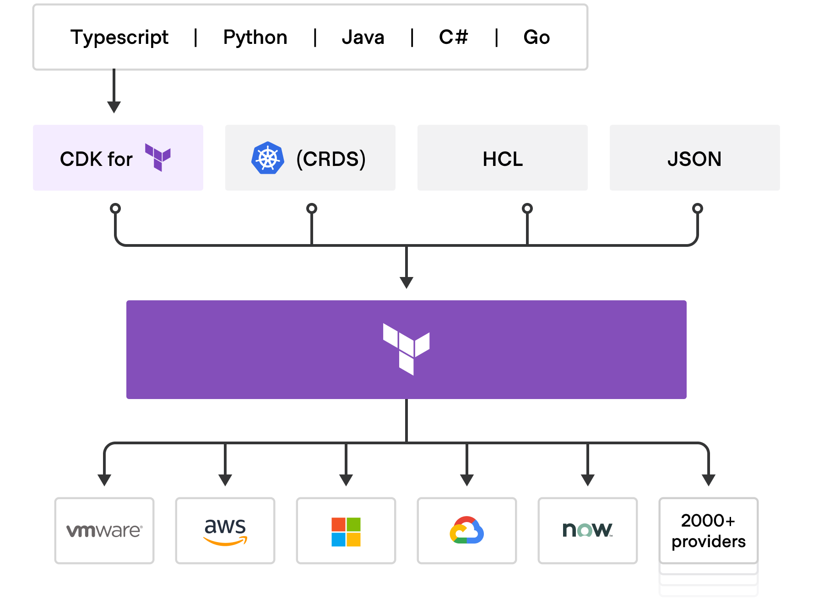
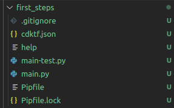
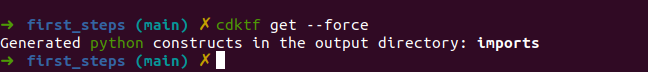
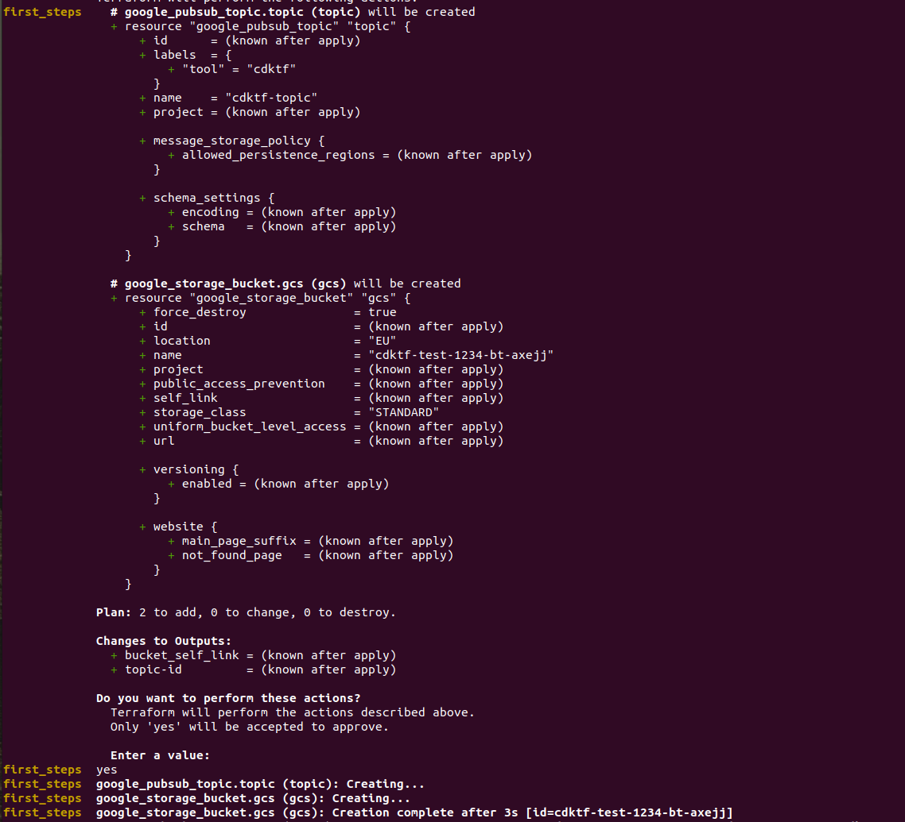
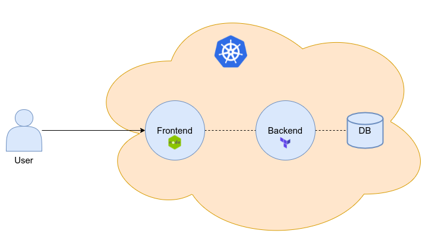

# Introduction

In this article we are goint to talk about CDKTF and how to use all its benefits to deploy infrastructure in a programatic and reusable way on GCP. We will also see how to integrate CDKTF with your [terraform modules](https://developer.hashicorp.com/terraform/language/modules) to deploy  more reusable infrastructure under the supervision of your organization.

CDKTF opens up a world of possibilities to take our organisation to the next level of automation, as well as making it easier for the people closest to the development side to deploy the infrastructure. In this article we will give some indications of when it is a good option to use CDKTF and when to continue using terraform through HCL, since not in all the cases of uses the CDKTF will bring us an added value.

Is CDKTF the miracle solution for deployments in our organisation? Let's have a look.

## What do you need to understand this article?

* Some concepts about [Terraform](https://developer.hashicorp.com/terraform).
* Install CDKTF, you can follow the next [guide](https://developer.hashicorp.com/terraform/tutorials/cdktf/cdktf-install).
* Some concepts about python.
* You need a free tier account in [GCP](https://console.cloud.google.com/)

## What is CDKTF?

CDKTF, also called Cloud Development Kit for Terraform, allows you to define and provision infrastructure in a programatic way. In this article we will use [Python](www.python.org) to deploy some resources on GCP. The strength of CDKTF is that you don't need to learn HashiCorp Configuration Language (HCL), you only need to know Python which is more flexible than HCL because it allows you to create more integrations with organizations tools and APIs. You can even create some specific class in Python to make your code more reusable.

<p align="center">
  
</p>

# First steps with CDKTF

Once CDKTF has been explained, we will proceed to create our first project. For this we will deploy a cloud storage bucket and a pubsub topic on GCP, we will be using plain terraform resources for simplicity. We will start by explaining several commands of the CDKTF:

```bash
cdktf init --template=python
```

This command creates a new CDK project for Terraform using a template. This is very usefull when you want to starts to use a new provider, in our case the Google provider.

Once this command has been executed we will see the following template:

<p align="center">
  
</p>

The most important files are `main.py` and `cdktf.json`. Let's talk about them.

In the file `main.py` is where all the infrastructure that we will deploy is declared. We will make use of the Google provider to define our resources, `cloud storage` and `pubsub topic`. Then to define and import the google provider and the storage and pubsub library we will import the following modules in python:

```python
from imports.google.provider import GoogleProvider
from imports.google.storage_bucket import StorageBucket
from imports.google.pubsub_topic import PubsubTopic
```

These providers are defined in the file cdktf.json, this file is where you can supply custom configuration settings for your application and define the providers and modules that you want to use. When we initialise the template with the command `cdktf init --template=python`, the template generates a basic cdktf.json file in your root directory that you can customize for your application.
This file has the following information:

```json
{
  "language": "python",
  "app": "pipenv run python main.py",
  "projectId": "da305019-c0fc-4e47-b4ad-1a705cdd8811",
  "sendCrashReports": "false",
  "terraformProviders": ["google@~> 4.0"],
  "terraformModules": [],
  "codeMakerOutput": "imports",
  "context": {
    "excludeStackIdFromLogicalIds": "true",
    "allowSepCharsInLogicalIds": "true"
  }
}
```

In the line terraformProviders we have defined the google provider which contains all the resources we need. In the section Integration with your own modules we will learn how configure this file to use your own terraform modules.

Once we have configured the providers we can now define our resources with Python:

```python
class MyStack(TerraformStack):
    def __init__(self, scope: Construct, id: str):
        super().__init__(scope, id)

        GoogleProvider(self, "google", region="europe-west4",project="xxxxx")
        length = 5
        suffix = ''.join((random.choice(string.ascii_lowercase) for x in range(length)))
        bucket = StorageBucket(self, "gcs", name = "cdktf-test-1234-bt-"+ str(suffix), location = "EU", force_destroy = True)
        topic = PubsubTopic(self, "topic" ,name = "cdktf-topic", labels={"tool":"cdktf"})
        TerraformOutput(self,"bucket_self_link",value=bucket.self_link)
        TerraformOutput(self,"topic-id",value=topic.id)

app = App()
MyStack(app, "first_steps")

app.synth()
```

These lines deploy a cloud storage and a topic, we have also created a random string in python to add to cloud storage as a suffix. For this purpose we have added two more libraries: `string` and `random`. In addition, we have added to our script some outputs to see some important information about our deployment like `topic_id` or `bucket_self_link`.
The final result of our first scripts with CDKTF is the following:

```python
from constructs import Construct
from cdktf import App, TerraformStack, TerraformOutput
from imports.google.provider import GoogleProvider
from imports.google.storage_bucket import StorageBucket
from imports.google.pubsub_topic import PubsubTopic
import random
import string

class MyStack(TerraformStack):
    def __init__(self, scope: Construct, id: str):
        super().__init__(scope, id)

        GoogleProvider(self, "google", region="europe-west4",project="xxxxx")
        length = 5
        suffix = ''.join((random.choice(string.ascii_lowercase) for x in range(length)))
        bucket = StorageBucket(self, "gcs", name = "cdktf-test-1234-bt-"+ str(suffix), location = "EU", force_destroy = True)
        topic = PubsubTopic(self, "topic" ,name = "cdktf-topic", labels={"tool":"cdktf"})
        TerraformOutput(self,"bucket_self_link",value=bucket.self_link)
        TerraformOutput(self,"topic-id",value=topic.id)

app = App()
MyStack(app, "first_steps")

app.synth()
```

Now we are able to deployment our infrastructure, to do this we need to execute some commands with CDKTF. First of all, we need to download the providers and modules for an application and generate the CDK constructs for them. We use `cdktf get` to do this. It uses the cdktf.json configuration file to read the list of providers. This command only generates currently missing provider bindings, so it is very fast if nothing has changed.

```bash
cdktf get
```

This is the command output:

<p align="center">
  
</p>

We use the flag --force to recreate all bindings. With the provider downloaded we will proceed with the deployment by running the `cdktf deploy` command:

```bash
cdktf deploy
```

This is the command output:

<p align="center">
  
</p>

With all these steps we have proceeded to deploy our first application with the cdktf. Something quite simple and with very reusable code. Now we are going to proceed to the destruction of the infrastructure so that we do not incur any cost. We will use the command `cdktf destroy`

# Integrations with your own modules

Perfect, once we have checked how the cdktf works we are going to integrate it with the terraform modules that are developed in our company. This would allow us to make the code much more reusable allowing everything that is deployed in the cdktf to be deployed with patterns that we have defined in the modules. For this test we will run the same creation (cloud storage and topic) but this time making use of the previously developed modules that you can find in my github. These modules have been developed with HCL and have certain nomenclatures and logic to make the deployment as easy as possible for the rest of the developers in my organization.

The modules we are going to use are in the following repositories:

* [Cloud Storage](https://github.com/lucasberlang/gcp-cloud-storage)
* [PubSub](https://github.com/lucasberlang/gcp-pubsub)

So let's proceed to create another template with the command `cdktf init --template=python` but this time to use our own modules.

Once executed we have the same template as in the previous section. Now we are going to proceed to modify the `cdktf.json` to add the modules we are going to use and two providers, google and google-beta, which are necessary for the use of these modules.
This is the `cdktf.json` file:

```json
{
  "language": "python",
  "app": "pipenv run python main.py",
  "projectId": "f02a016f-d673-4390-86db-65348eadfb3f",
  "sendCrashReports": "false",
  "terraformProviders": ["google@~> 4.0", "google-beta@~> 4.0"],
  "terraformModules": [
    {
      "name": "gcp_pubsub",
      "source": "git::https://github.com/lucasberlang/gcp-pubsub.git?ref=v1.2.0"
    },
    {
      "name": "gcp_cloud_storage",
      "source": "git::https://github.com/lucasberlang/gcp-cloud-storage.git?ref=v1.2.0"
    }
  ],
  "codeMakerOutput": "imports",
  "context": {
    "excludeStackIdFromLogicalIds": "true",
    "allowSepCharsInLogicalIds": "true"
  }
}
```

We have added the terraform Modules line where we indicate the name of the module and the source, in this case our github repository. We have also added the terraform providers line as in the previous section.

Once we have added the providers and the terraform modules we are going to instantiate them in our main, for this we only have to add them as libraries and then invoke them with the parameters that are defined in our module. You can go to the readme of the module that is uploaded in github to see which parameters are mandatory and which are optional, also you can see outputs of those modules.

The code snippets looks like this:

```python
#!/usr/bin/env python
from constructs import Construct
from cdktf import App, TerraformStack, TerraformOutput
from imports.google.provider import GoogleProvider
from imports.google_beta.provider import GoogleBetaProvider
from imports.gcp_pubsub import GcpPubsub
from imports.gcp_cloud_storage import GcpCloudStorage
import random
import string

class MyStack(TerraformStack):
    def __init__(self, scope: Construct, ns: str):
        super().__init__(scope, ns)


        GoogleProvider(self, "google", region="europe-west4")
        GoogleBetaProvider(self, "google-beta", region="europe-west4")
        length = 5
        suffix = ''.join((random.choice(string.ascii_lowercase) for x in range(length)))
        tags = {"provider" : "go",
                "region" : "euw4",
                "enterprise" : "bt",
                "account" : "poc",
                "system" : "ts",
                "environment" : "poc",
                "cmdb_name" : "",
                "security_exposure_level" : "mz",
                "status" : "",
                "on_service" : "yes"}

        topic = GcpPubsub(self,"topic",
          name = "cdktf-topic",
          project_id = "xxxxxxx",
          offset = 1,
          tags = tags)
          
        bucket = GcpCloudStorage(self,"bucket",
          name = "cdktf-test-1234-bt-" + suffix,
          project_id = "xxxxxxx",
          offset = 1,
          location = "europe-west4",
          force_destroy = True,
          tags = tags)
        
        TerraformOutput(self,"topic_id",value=topic.id_output)
        TerraformOutput(self,"bucket_self_link",value=bucket.bucket_output)

app = App()
MyStack(app, "cdktf_modules")

app.synth()
```

To invoke our modules that we have previously added in the cdktf.json file, we just need to add this snippet: 

```python
from imports.gcp_pubsub import GcpPubsub
from imports.gcp_cloud_storage import GcpCloudStorage
```

The rest of the code is the invocation of our modules with a series of parameters to initialise them, such as region, name etc. We have also added the outputs to have some information about the creation of the resources in GCP. Now, let's proceed to the deployment of the resources to check the correct functioning of CDKTF.

```bash
cdktf get --force
cdktf deploy
```

Once deployed, we will check our infrastructure in GCP and proceed to delete it all with the command `cdktf destroy`.

# Evolutions you can add to your company

Thanks to the cdktf we can create new automatisms much more native than with traditional HCL because we can integrate with all types of backend in our own development. This opens up a whole new world of possibilities in the automatic deployment of infrastructure.

For example, if in your company you are always asked for the same type of infrastructure from the development teams, such as a database, a kubernetes cluster and then the security and communications components associated with the use case, why not automate this process and not create terraform projects on demand?.

We can evolve our automation platform by creating a web front end that invokes our microservice made with the CDKTF that will do the appropriate validations and then proceed to deploy. This could also be done with terraform but not in such a native way as with the CDKTF because now using python (or another language, Typescript, Go etc...) we can create much more complex workflows calling other backends and making all kinds of integrations with our corporate tools. We could generate a deployment platform to automate all our generic deployments that are requested from other teams, applications, data analytics, reporting, etc. We could create the following architecture to solve this problem:

<p align="center">
  
</p>

# Conclusions

Having worked for several years with terraform I think that the CDKTF is its natural evolution, although it is still in a premature phase. It does not have as large a community as terraform has with HCL which makes it difficult to get started with this tool. Debugging the code is often complicated and not as easy as with HCL. The official tutorials are not very complete so many times you will have to find your own way to solve some problems derived from the use of CDKTF. I also think that the CDKTF is at a point of maturity as terraform was years ago in the version below 0.11.0, that is to say, it works well although it still has a long way to go.

I think that if your company is already using terraform (HCL) in a mature way, changing the model to CDKTF is not going to be of much benefits. The only benefit of using CDKTF is in a use case like the one mentioned in the previous section, where you can mix the use of your modules already developed with HCL and CDKTF to take the automation of certain infrastructure to a higher level.

On the other hand, CDKTF is a tool I could recommend if you know python (or other languages) and don't want to learn a specific language like HCL. CDKTF can be a good tool if your company is not at an advanced maturity point with terraform or any IaC tool. The CDKTF allows you to develop in a simpler way your infrastructure as code, integrations with other tools within your organisation will be much easier as you will be able to use your favourite programming language to do them. You can create reusable classes and modules in a simple way, creating a CDKTF development community within your own company and allowing developers to be more attached to the infrastructure which is always a challenge. Also the testing part of your CDKTF code will be much easier and native by making use of pytest or other [frameworks](https://developer.hashicorp.com/terraform/cdktf/test/unit-tests). Testing with terraform (HCL) is more tedious and you already have to use frameworks like terratest to integrate them into your code.

Overall I think the CDKTF is a good tool and is the natural evolution of Terraform. If we want to take our automation to another level and integrate it with web portals or organisational tools, CDKTF is the tool for us. It also opens up a world of possibilities for development teams as they will be able to deploy any kind of infrastructure using a programming language. We will have to see how it evolves to see how it fits into our organisations and whether it reaches the point of maturity that Terraform has reached.
